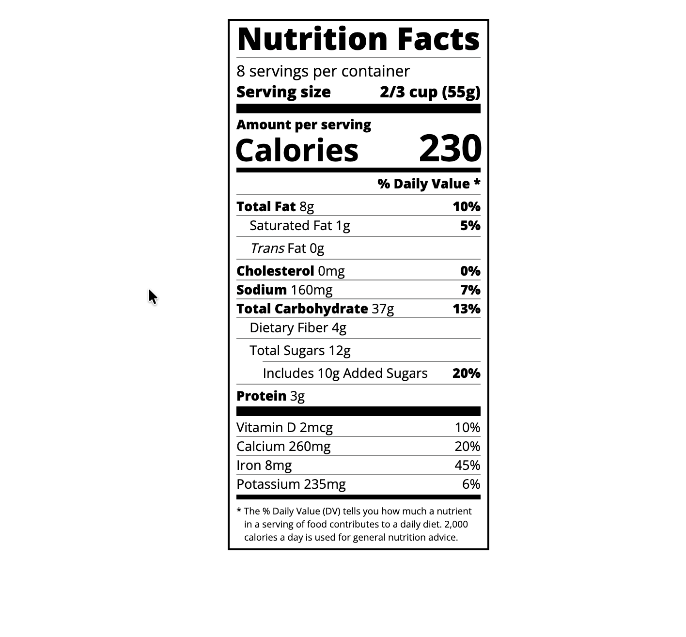

# Nutrition Label Project 🍎



A web-based **nutrition label** built with HTML and CSS. This project replicates a standard nutrition facts label like those found on packaged foods.

---

## Features

- Structured **nutrition facts layout** with proper headers and dividers
- **Bold text** and **flexbox alignment** for nutrient values
- **Daily Value percentages** aligned to the right
- Includes a **note section** explaining % Daily Value
- Demonstrates use of **spans, paragraphs, and classes** for layout and styling

---

## Technologies Used

- HTML5
- CSS3
- Google Fonts (Open Sans)

---

## Usage

1. Clone the repository:

```bash
git clone https://github.com/YOUR_USERNAME/nutrition-label-project.git
